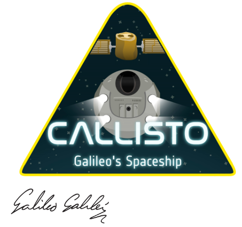

<h1> Callisto - Open Source Campaign </h1>

Calling all Android developers with passion for space!

**Callisto** is a navigation-based game for Android, using Europe's satellite navigation system Galileo. The project began as an entry to **European Space Agency’s Galileo App Competition 2017-2018** and successfully made it to the finals as one of the top three apps.

As the original developers we are now calling on all GNSS and app enthusiasts to contribute to the project and help to realise it to its final form. We will reward authors of merge requests which address identified issues with unique space prizes in the form of Galileo phone stickers and Callisto mission patches!

You can find the Callisto code base as an [open-source project](https://github.com/matejpoliacek/Callisto) on Github. Developers are welcome to fix the identified issues or suggest their own improvements by submitting a pull request to the ‘staging’ branch. These range from improving existing features and performance optimisations, to UI/UX upgrades and alignment with general Android app standards & requirements. And for those particularly familiar with GNSS concepts (or at the very least extremely brave), we won’t say no to any improvements to the PNT algorithms!

Code away!

## More info

- [App competition final article by ESA](http://www.esa.int/Our_Activities/Navigation/ESA_trainees_compete_in_inaugural_Galileo_app_contest)
- [App competition winner: GNSS Compare (now used as a backend for callisto)](https://play.google.com/store/apps/details?id=com.galfins.gnss_compare)

