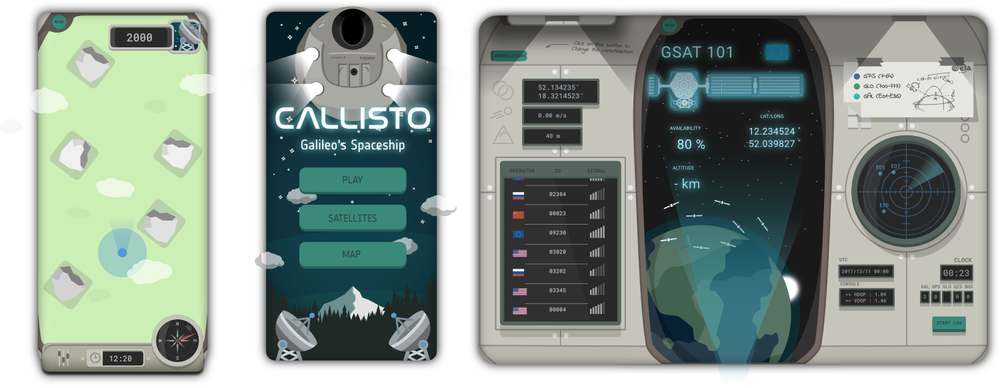
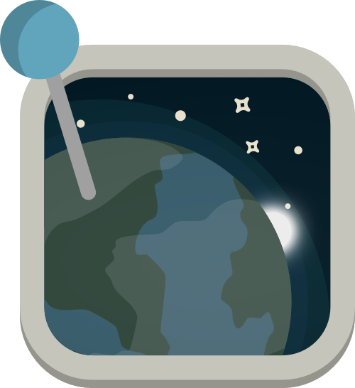

<h1> Callisto  </h1>

**Callisto** is a **navigation-based game** for **Android**, using Europe's global navigation satellite system **Galileo**.

The project began as an entry to **European Space Agency’s Galileo App Competition 2017-2018** and was awarded as one of the three apps that successfully made it to the finals.

## Screenshots

## More info

- [App competition final article by ESA](http://www.esa.int/Our_Activities/Navigation/ESA_trainees_compete_in_inaugural_Galileo_app_contest)
- [ESA Article about released apps] (https://www.esa.int/Our_Activities/Navigation/Gaming_with_Galileo_new_Android_smartphone_apps_published)

- [App competition winner: GNSS Compare (now used as a backend for callisto)](https://play.google.com/store/apps/details?id=com.galfins.gnss_compare)

